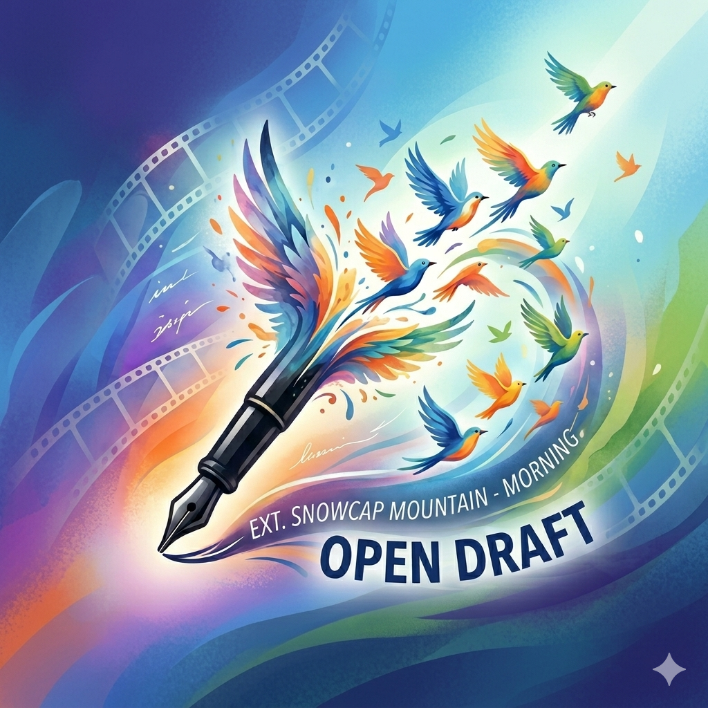
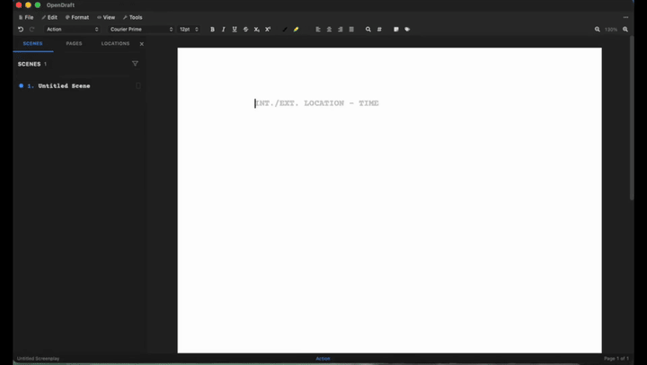
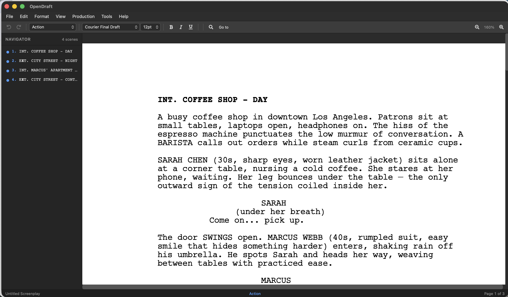
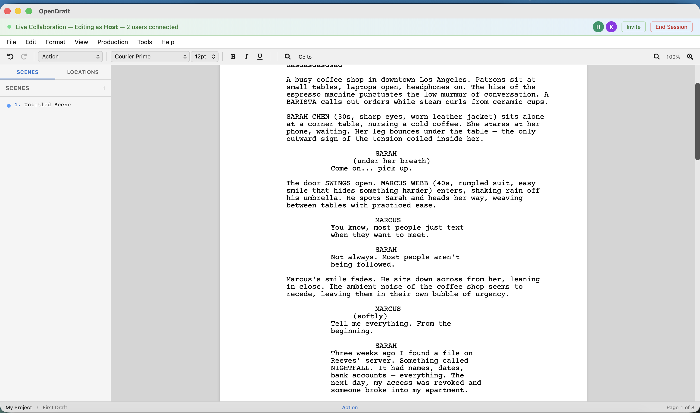
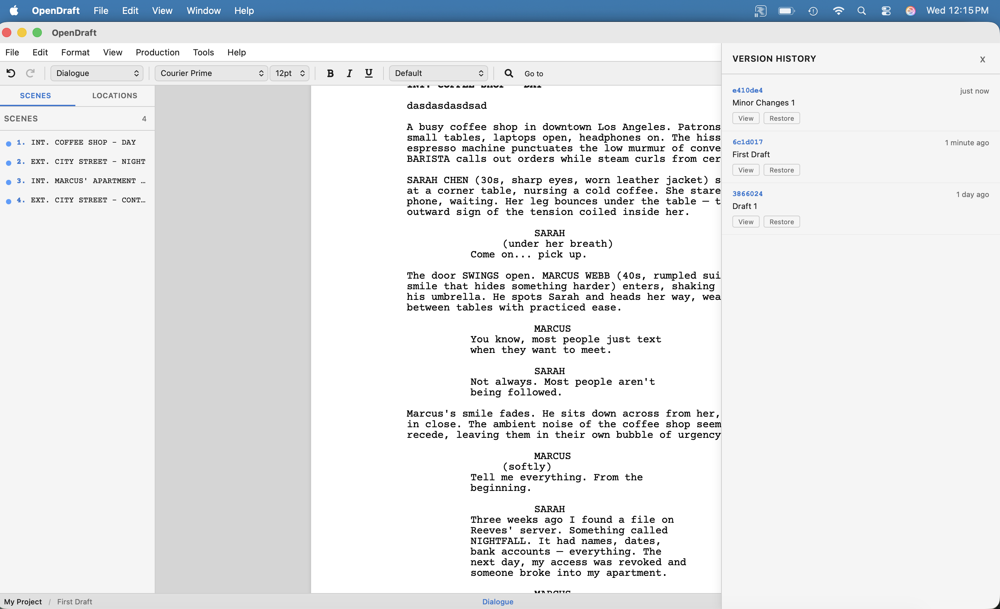

<p align="center">
  
</p>

<h1 align="center">OpenDraft</h1>

<p align="center">
  <strong>The free alternative to Final Draft</strong><br>
  No subscription. No cloud lock-in. Own your scripts forever.
</p>

<p align="center">
  <a href="https://opendraft-demo-267958344432.us-central1.run.app">
    
  </a>
  <a href="https://github.com/Proteus-Technologies-Private-Limited/OpenDraft/releases/latest">
    
  </a>
  <a href="https://github.com/Proteus-Technologies-Private-Limited/OpenDraft/stargazers">
    
  </a>
  <a href="LICENSE">
    
  </a>
</p>

<p align="center">
  <a href="https://proteus-technologies-private-limited.github.io/OpenDraft/">Website</a> &bull;
  <a href="https://opendraft-demo-267958344432.us-central1.run.app">Try Demo</a> &bull;
  <a href="#download">Download</a> &bull;
  <a href="#features">Features</a> &bull;
  <a href="#screenshots">Screenshots</a> &bull;
  <a href="#comparison">Compare</a> &bull;
  <a href="#contributing">Contributing</a> &bull;
  <a href="https://github.com/Proteus-Technologies-Private-Limited/OpenDraft/discussions">Community</a>
</p>

<p align="center">
  
</p>

<p align="center">
  <strong>Industry-standard screenplay formatting</strong> &bull;
  <strong>Works 100% offline</strong> &bull;
  <strong>Free forever, open-source (MIT)</strong>
</p>

<p align="center">
  <a href="https://opendraft-demo-267958344432.us-central1.run.app">
    
  </a>
</p>
<p align="center"><em>No account. No install. Opens in seconds.</em></p>

---

## Why OpenDraft?

Your script is your intellectual property. Cloud-based screenwriting tools store your work on corporate servers — where it can be mined, leaked, or used to train AI. OpenDraft keeps every word on your machine.

- **Never pay for your own words** — Free forever under the MIT license. No trial, no subscription, no feature gating.
- **Switch without starting over** — Import from Final Draft (.fdx), Fountain, or PDF. Export anytime. Your scripts are never locked in.
- **Write anywhere, even offline** — Desktop apps for Mac, Windows, and Linux. Mobile apps for iOS and Android. No internet required.
- **Collaborate when you want to** — Invite co-writers with a link. Real-time cursors and permissions. When the session ends, nothing stays on any server.

---

## Features

| | |
|---|---|
| **Screenplay Editor** | Industry-standard formatting with autocomplete for character names, scene headings, and transitions |
| **Beat Board** | Plan your story visually with drag-and-drop index cards before you write a single page |
| **Real-Time Collaboration** | Write with your partner simultaneously — live cursors, presence, and edit/view permissions |
| **Version History** | Check in drafts, compare versions side-by-side, and restore any previous draft instantly |
| **Character Profiles** | Track characters with descriptions, role types, and color-coded highlighting in your script |
| **Import & Export** | Move freely between Final Draft (.fdx), Fountain, and PDF — never locked into one tool |

> See the [full feature list](docs/FEATURES.md) for scene navigator, spell check, search & replace, script notes, asset management, and more.

---

## Screenshots

<p align="center">
  <br>
  <em>Industry-standard screenplay formatting with scene navigator</em>
</p>

<p align="center">
  <br>
  <em>Visual story planning with drag-and-drop index cards</em>
</p>

<p align="center">
  <br>
  <em>Real-time collaboration — multiple writers editing simultaneously</em>
</p>

<p align="center">
  <br>
  <em>Built-in version history with check-in, diff, and restore</em>
</p>

---

## Comparison

How does OpenDraft stack up against commercial screenwriting software?

| Feature | OpenDraft | Final Draft | WriterDuet | Fade In |
|---------|:---------:|:-----------:|:----------:|:-------:|
| **Price** | Free | $250 | Free / $12/mo | $80 |
| **Open Source** | Yes (MIT) | No | No | No |
| **Offline Desktop App** | Yes | Yes | Limited | Yes |
| **Real-time Collaboration** | Yes | Yes | Yes | Yes |
| **Beat Board / Index Cards** | Yes | Yes | Yes | Yes |
| **Version History with Diff** | Yes | Limited | Limited | Limited |
| **Self-Hostable** | Yes | No | No | No |
| **Linux Support** | Yes | No | Yes (paid) | Yes |
| **No Account Required** | Yes | No | No | Yes |
| **Privacy-First (No Tracking)** | Yes | No | No | No |
| **Character Profiles** | Yes | Limited | No | No |
| **Casting / Reference Images** | Yes | No | No | No |
| **iOS App** | Yes | Yes | Yes | Yes |
| **Android App** | Yes | No | Yes | Yes |
| **Production Tags** | Yes | Limited | Yes | Yes |
| **Fountain Import/Export** | Yes | No | Yes | Yes |
| **Web Browser Access** | Yes | No | Yes | Limited |
| **Plugin Architecture** | Yes | No | No | No |

---

## Download

Get the latest version — no account required, just install and start writing.

### Desktop

| Platform | Download |
|----------|----------|
| **macOS** (Apple Silicon) | [Download .dmg](https://github.com/Proteus-Technologies-Private-Limited/OpenDraft/releases/latest/download/OpenDraft_0.14.1_aarch64.dmg) |
| **Windows** (64-bit) | [Download .exe](https://github.com/Proteus-Technologies-Private-Limited/OpenDraft/releases/latest/download/OpenDraft_0.14.1_x64-setup.exe) |
| **Windows** (MSI) | [Download .msi](https://github.com/Proteus-Technologies-Private-Limited/OpenDraft/releases/latest/download/OpenDraft_0.14.1_x64_en-US.msi) |
| **Linux** (Debian/Ubuntu) | [Download .deb](https://github.com/Proteus-Technologies-Private-Limited/OpenDraft/releases/latest/download/OpenDraft_0.14.1_amd64.deb) |
| **Linux** (AppImage) | [Download .AppImage](https://github.com/Proteus-Technologies-Private-Limited/OpenDraft/releases/latest/download/OpenDraft_0.14.1_amd64.AppImage) |
| **Linux** (RPM/Fedora) | [Download .rpm](https://github.com/Proteus-Technologies-Private-Limited/OpenDraft/releases/latest/download/OpenDraft-0.14.1-1.x86_64.rpm) |

### Mobile

<p>
  <a href="https://apps.apple.com/us/app/open-draft-screenwriting/id6761807809">
    
  </a>
  &nbsp;&nbsp;
  <a href="https://play.google.com/store/apps/details?id=com.proteus.opendraft">
    
  </a>
</p>

> The app is fully standalone — everything you need is bundled inside. No account, no setup.

For all versions and platforms, visit the [Releases](https://github.com/Proteus-Technologies-Private-Limited/OpenDraft/releases) page.

---

## Contributing

We welcome contributions from everyone! Whether you're fixing a typo, reporting a bug, or building a new feature — every contribution matters.

- **New here?** Check out issues labeled [`good first issue`](https://github.com/Proteus-Technologies-Private-Limited/OpenDraft/labels/good%20first%20issue).
- **Have a question?** Start a [Discussion](https://github.com/Proteus-Technologies-Private-Limited/OpenDraft/discussions).
- **Found a bug?** [Open an issue](https://github.com/Proteus-Technologies-Private-Limited/OpenDraft/issues/new/choose).
- **Want to contribute code?** See [docs/CONTRIBUTING.md](docs/CONTRIBUTING.md).

---

## For Developers

<details>
<summary>Tech Stack, Project Structure, and Development Setup</summary>

### Tech Stack

| Layer | Technology |
|-------|-----------|
| Frontend | React 19, TypeScript, Vite, TipTap editor |
| Backend | Python 3.12, FastAPI, Uvicorn |
| Desktop | Tauri 2 (Rust) with bundled Python backend |
| Collaboration | Hocuspocus WebSocket server, Yjs CRDT |
| State Management | Zustand |
| Version Control | Git (per-project, built-in) |

### Project Structure

```
OpenDraft/
├── frontend/          # React + TypeScript web UI
├── backend/           # FastAPI Python API server
├── collab-server/     # Real-time collaboration server (Node.js)
├── src-tauri/         # Tauri 2 desktop app shell (Rust)
├── docs/              # Documentation
├── images/            # Logos and assets
├── setup.sh           # One-click browser setup script
├── build.sh           # Web build script
└── build-desktop.sh   # Desktop app build script
```

### Development

```bash
# Clone and install
git clone https://github.com/Proteus-Technologies-Private-Limited/OpenDraft.git
cd OpenDraft

# Backend
python3.12 -m venv venv
source venv/bin/activate
pip install -r backend/requirements.txt

# Frontend
cd frontend && npm install && cd ..

# Start development servers (in separate terminals)
./start_backend.sh    # API server on http://localhost:8000
./start_frontend.sh   # Dev server on http://localhost:5173
```

### Building Desktop App

```bash
./build-desktop.sh
# Output: src-tauri/target/release/bundle/
```

See [docs/desktop-build.md](docs/desktop-build.md) for detailed desktop build instructions.

### Run in Browser (Self-Hosted)

To run your own instance of OpenDraft in a browser:

```bash
git clone https://github.com/Proteus-Technologies-Private-Limited/OpenDraft.git
cd OpenDraft
./setup.sh
```

Installs dependencies, builds the app, and opens it at **http://localhost:8000**.

Requires Python 3.12+, Node.js 18+, and Git. See [docs/INSTALLATION.md](docs/INSTALLATION.md) for details.

</details>

---

## License

OpenDraft is open-source software licensed under the [MIT License](LICENSE). Free to use, modify, and distribute.

---

<p align="center">
  Built by screenwriters and engineers at <a href="https://github.com/Proteus-Technologies-Private-Limited">Proteus Technologies</a>
</p>

<p align="center">
  <em>Write screenplays, not subscriptions.</em><br>
  If OpenDraft helps your writing, a <a href="https://github.com/Proteus-Technologies-Private-Limited/OpenDraft">star on GitHub</a> helps others discover it.
</p>
