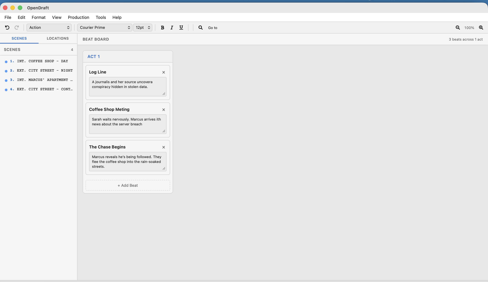
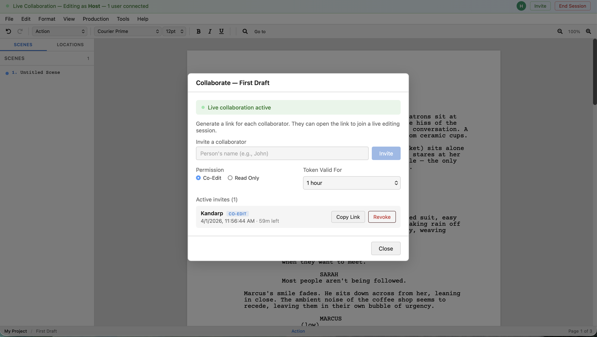
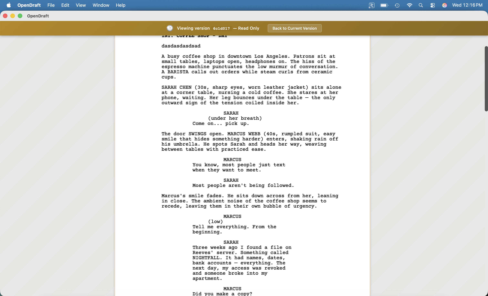
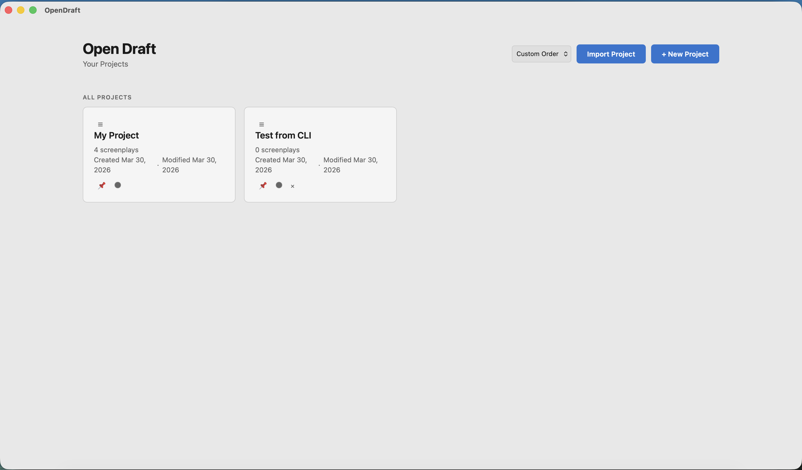
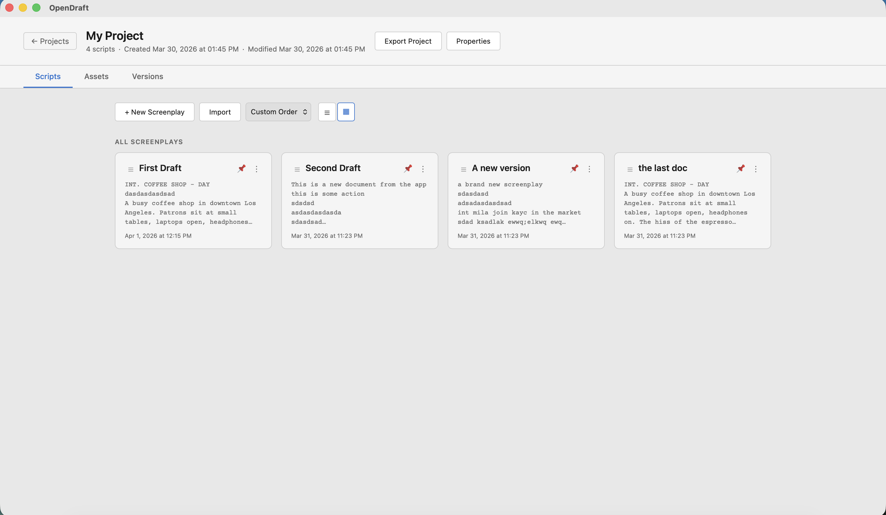

<p align="center">
  
</p>

<h1 align="center">OpenDraft</h1>

<p align="center">
  <strong>Free, open-source screenwriting software — a modern alternative to Final Draft</strong><br>
  Professional screenplay formatting, real-time collaboration, beat boards, and version control.<br>
  No subscription. No cloud lock-in. No tracking. Just write.
</p>

<p align="center">
  <a href="https://github.com/Proteus-Technologies-Private-Limited/OpenDraft/releases/latest">
    
  </a>
  <a href="LICENSE">
    
  </a>
  <a href="https://github.com/Proteus-Technologies-Private-Limited/OpenDraft/stargazers">
    
  </a>
  <a href="https://github.com/Proteus-Technologies-Private-Limited/OpenDraft/discussions">
    
  </a>
</p>

<p align="center">
  <a href="#download-desktop-app">Desktop App</a> &bull;
  <a href="#features">Features</a> &bull;
  <a href="#screenshots">Screenshots</a> &bull;
  <a href="#comparison">Compare</a> &bull;
  <a href="#contributing">Contributing</a> &bull;
  <a href="https://github.com/Proteus-Technologies-Private-Limited/OpenDraft/discussions">Community</a>
</p>

---

## Download Desktop App

Get the latest version for your operating system — no setup, no account, just install and write.

| Platform | Download |
|----------|----------|
| **macOS** (Apple Silicon) | [Download .dmg](https://github.com/Proteus-Technologies-Private-Limited/OpenDraft/releases/latest/download/OpenDraft_0.6.1_aarch64.dmg) |
| **Windows** (64-bit) | [Download .exe](https://github.com/Proteus-Technologies-Private-Limited/OpenDraft/releases/latest/download/OpenDraft_0.6.1_x64-setup.exe) |
| **Windows** (MSI) | [Download .msi](https://github.com/Proteus-Technologies-Private-Limited/OpenDraft/releases/latest/download/OpenDraft_0.6.1_x64_en-US.msi) |
| **Linux** (Debian/Ubuntu) | [Download .deb](https://github.com/Proteus-Technologies-Private-Limited/OpenDraft/releases/latest/download/OpenDraft_0.6.1_amd64.deb) |
| **Linux** (AppImage) | [Download .AppImage](https://github.com/Proteus-Technologies-Private-Limited/OpenDraft/releases/latest/download/OpenDraft_0.6.1_amd64.AppImage) |
| **Linux** (RPM/Fedora) | [Download .rpm](https://github.com/Proteus-Technologies-Private-Limited/OpenDraft/releases/latest/download/OpenDraft-0.6.1-1.x86_64.rpm) |

> After downloading, open the installer and follow the prompts. The app is fully standalone — everything you need is bundled inside.

For all versions and platforms, visit the [Releases](https://github.com/Proteus-Technologies-Private-Limited/OpenDraft/releases) page.

---

## Why OpenDraft?

OpenDraft gives you **everything you need to write a screenplay** — without paying $250 for Final Draft or trusting your scripts to someone else's cloud.

- Works **100% offline** on your machine. No account required.
- **Real-time collaboration** when you want it — invite co-writers with a link.
- **Free forever** (MIT license). No trial, no subscription, no feature gating.
- **Privacy-first** — zero tracking, zero analytics, zero data collection.

---

## Features

- **Industry-standard screenplay editor** — Scene headings, action, character, dialogue, parenthetical, transition, and shot elements with proper formatting
- **Beat Board & Index Cards** — Visual story planning with drag-and-drop scene organization
- **Scene Navigator** — Jump between scenes instantly
- **Character Profiles** — Track characters with role types, highlight colors, and rich descriptions
- **Character Autocomplete** — Smart suggestions as you type character names
- **Version History** — Built-in version control with check-in, diff, and restore
- **Project Management** — Organize multiple screenplays with metadata (genre, logline, synopsis, etc.)
- **Asset Management** — Attach reference images, research docs, and notes to your projects
- **Script Notes** — Inline annotations for screenplay review and feedback
- **Search & Replace** — Find and replace across your screenplay
- **Spell Check** — Built-in spell checker with custom dictionary support
- **Import/Export** — Work with standard screenplay formats (PDF, FDX, Fountain)
- **Real-time Collaboration** — Multiple writers editing simultaneously with live cursors
- **Cross-platform** — Desktop app (macOS, Windows, Linux) and browser-based

---

## Run in Browser (Self-Hosted)

If you prefer to run OpenDraft in your browser instead of the desktop app, use the one-line setup script:

### Quick Start

```bash
git clone https://github.com/Proteus-Technologies-Private-Limited/OpenDraft.git
cd OpenDraft
./setup.sh
```

That's it. The script installs dependencies, builds the app, and opens it in your browser at **http://localhost:8000**.

### Requirements

- **Python 3.12+** — [Download Python](https://www.python.org/downloads/)
- **Node.js 18+** — [Download Node.js](https://nodejs.org/)
- **Git** — [Download Git](https://git-scm.com/downloads)

> See [docs/INSTALLATION.md](docs/INSTALLATION.md) for detailed step-by-step instructions, troubleshooting, and manual setup.

---

## Screenshots

<p align="center">
  <br>
  <em>Industry-standard screenplay formatting with scene navigator</em>
</p>

<p align="center">
  <br>
  <em>Visual story planning with Beat Board</em>
</p>

<p align="center">
  <br>
  <em>Real-time collaboration — multiple users editing simultaneously</em>
</p>

<p align="center">
  <br>
  <em>Invite collaborators with granular permissions (Co-Edit / Read Only)</em>
</p>

<p align="center">
  <br>
  <em>Built-in version history — check in drafts, view and restore any version</em>
</p>

<p align="center">
  <br>
  <em>View any previous version in read-only mode</em>
</p>

<p align="center">
  <br>
  <em>Manage multiple projects from the home screen</em>
</p>

<p align="center">
  <br>
  <em>Project detail view with screenplay cards, assets, and versions</em>
</p>

---

## Comparison

How does OpenDraft stack up against commercial screenwriting software?

| Feature | OpenDraft | Final Draft | WriterDuet | Fade In |
|---------|:---------:|:-----------:|:----------:|:-------:|
| **Price** | Free | $250 | $12/mo | $80 |
| **Open Source** | Yes (MIT) | No | No | No |
| **Offline Desktop App** | Yes | Yes | Limited | Yes |
| **Real-time Collaboration** | Yes | No | Yes | No |
| **Beat Board / Index Cards** | Yes | Yes | No | No |
| **Version History with Diff** | Yes | No | Yes | No |
| **Self-Hostable** | Yes | No | No | No |
| **Linux Support** | Yes | No | Browser only | Yes |
| **No Account Required** | Yes | No | No | No |
| **Privacy-First (No Tracking)** | Yes | No | No | No |
| **Character Profiles** | Yes | No | No | No |
| **Plugin Architecture** | Yes | No | No | No |

---

## Tech Stack

| Layer | Technology |
|-------|-----------|
| Frontend | React 19, TypeScript, Vite, TipTap editor |
| Backend | Python 3.12, FastAPI, Uvicorn |
| Desktop | Tauri 2 (Rust) with bundled Python backend |
| Collaboration | Hocuspocus WebSocket server, Yjs CRDT |
| State Management | Zustand |
| Version Control | Git (per-project, built-in) |

---

## Project Structure

```
OpenDraft/
├── frontend/          # React + TypeScript web UI
├── backend/           # FastAPI Python API server
├── collab-server/     # Real-time collaboration server (Node.js)
├── src-tauri/         # Tauri 2 desktop app shell (Rust)
├── docs/              # Documentation
├── images/            # Logos and assets
├── setup.sh           # One-click browser setup script
├── build.sh           # Web build script
└── build-desktop.sh   # Desktop app build script
```

---

## Contributing

We welcome contributions from everyone! Whether you're fixing a typo, reporting a bug, or building a new feature — every contribution matters.

- **New here?** Check out issues labeled [`good first issue`](https://github.com/Proteus-Technologies-Private-Limited/OpenDraft/labels/good%20first%20issue) for beginner-friendly tasks.
- **Have a question?** Start a [Discussion](https://github.com/Proteus-Technologies-Private-Limited/OpenDraft/discussions).
- **Found a bug?** [Open an issue](https://github.com/Proteus-Technologies-Private-Limited/OpenDraft/issues/new/choose).
- **Want to contribute code?** See [docs/CONTRIBUTING.md](docs/CONTRIBUTING.md) for setup and guidelines.

---

## Development

For developers who want to work on OpenDraft:

```bash
# Clone and install
git clone https://github.com/Proteus-Technologies-Private-Limited/OpenDraft.git
cd OpenDraft

# Backend
python3.12 -m venv venv
source venv/bin/activate
pip install -r backend/requirements.txt

# Frontend
cd frontend && npm install && cd ..

# Start development servers (in separate terminals)
./start_backend.sh    # API server on http://localhost:8000
./start_frontend.sh   # Dev server on http://localhost:5173
```

### Building Desktop App

```bash
./build-desktop.sh
# Output: src-tauri/target/release/bundle/
```

See [docs/desktop-build.md](docs/desktop-build.md) for detailed desktop build instructions.

---

## License

OpenDraft is open-source software licensed under the [MIT License](LICENSE). Free to use, modify, and distribute.

---

<p align="center">
  Made with care by <a href="https://github.com/Proteus-Technologies-Private-Limited">Proteus Technologies</a>
</p>

<p align="center">
  If OpenDraft helps your writing, consider giving it a <a href="https://github.com/Proteus-Technologies-Private-Limited/OpenDraft">star on GitHub</a> — it helps others discover the project.
</p>
